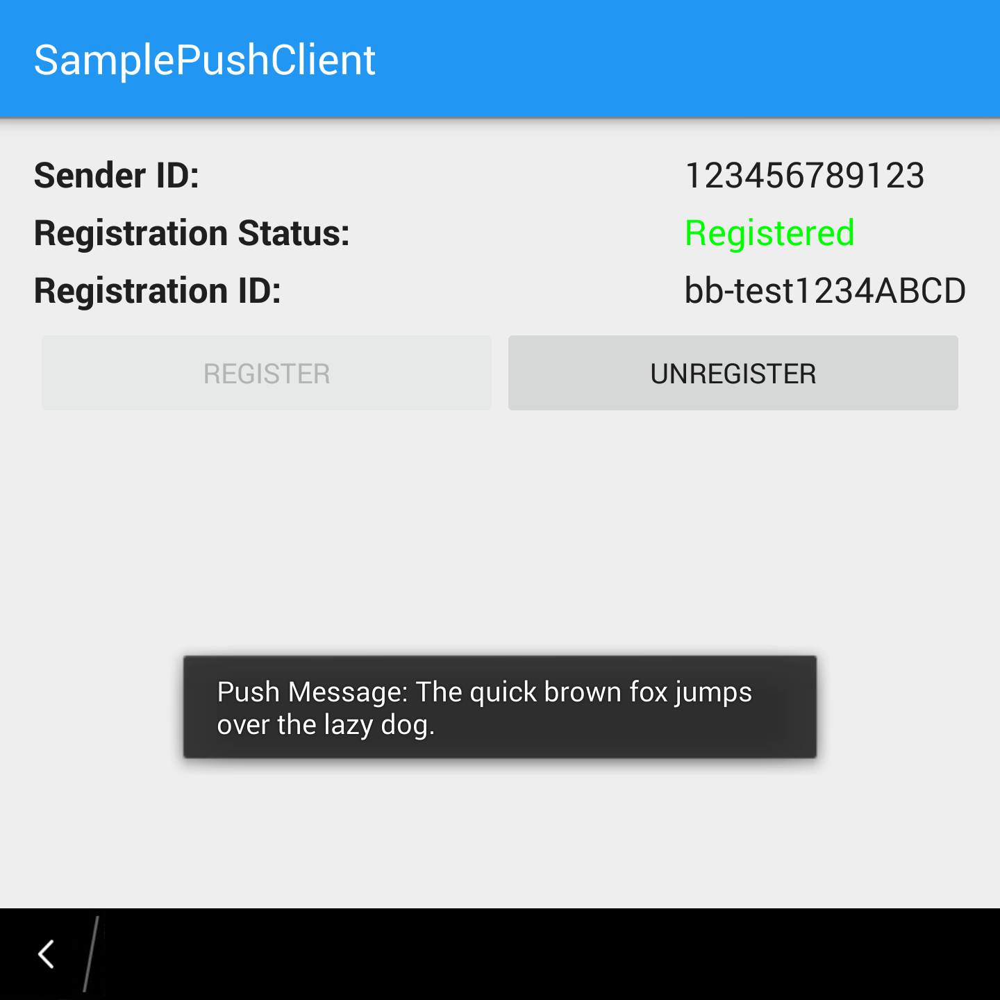

# SamplePushClient - BlackBerry Android Runtime Sample

This sample application is intended to assist developers who want to configure push notifications in their Android application for BB10.

This sample utilizes the standalone (non Google Play Services dependent) Google Cloud Messaging SDK.

The code in this sample covers the client side configuration and NOT the server side code required for Push.

For more information, visit [Creating Push-enabled Android apps](https://developer.blackberry.com/android/apisupport/creating_push-enabled_android_apps.html)

**Author(s)** 

* Andrew Frolkin

## Screenshots ##

## Preliminary Setup

1. [Install Android Studio] (https://developer.android.com/sdk/installing/index.html?pkg=studio) (if not installed)
2. [Install the BlackBerry Plugin for Android Studio](http://developer.blackberry.com/android/documentation/bb_android_studio_plugin_tool.html) (if not installed)
3. [Register to evaluate the BlackBerry Push Service](https://www.blackberry.com/profile/?eventId=8121). After registering, you will receive the **BlackBerry Push Credentials** required to enable push notifications on your app
4. (Optional) If you wish to receive push notifications on other Android Devices, [Enable and configure the Google Cloud Messaging Service for your app](https://developers.google.com/mobile/add) to obtain a Cloud Messaging Server **API Key** and **Sender ID**

## How To Build

1. Clone the repo to your computer
2. In Android Studio, click on File -> Import Project, and select the project root directory (for example SamplePushClient)
3. Fill in your BlackBerry Push Credentials in the android.cfg file in assets/blackberry/android.cfg
4. (Optional) If you wish to test this app on non BB10 devices, set the SENDER_ID string in CommonUtilities to the **Sender ID** received when enabling Google Cloud Messaging for your app. The SENDER_ID can be set to any value if this app is only receiving push messages on BB10 devices
5. [Create a signed APK] (http://developer.android.com/tools/publishing/app-signing.html#studio)
6. [Repackage and Deploy the App using the BlackBerry Plugin] (http://developer.blackberry.com/android/documentation/rpkg_with_bb_plugin_for_android_stdio.html)

## Sending A Push Message to a BB10 Device Using the BlackBerry Sample Push Initiators

1. [Download and Start the BlackBerry Sample Push Initiators](http://developer.blackberry.com/bbos/java/documentation/using_sample_push_initiators.html)
2. Fill in the Username / Application Id and Password fields with the credentials obtained after registering for the BlackBerry Push Service
3. Fill in the data field with the push message. Note that the data sent from the Push Initiators MUST BE FORMATTED AS JSON. By default, this sample app will read the push message from the "message" key. For example, for this app, the data sent from the server must be formatted as: "{ "message":"Your push message here." }"
4. Enter the BlackBerry device PIN into the address field (NOT the Registration ID from the SamplePushClient app)
5. Make sure the SamplePushClient app Registration Status is "Registered". If the status is not "Registered", make sure the push credentials are correct within the app and the device has internet access
6. If configured correctly, the app will display the Push Message in a toast notification and a system wide notification when a push request is sent

## Sending a Push Message to any other Android Device

1. Install the app on an Android device
2. As long as the SENDER_ID in CommonUtilites is correctly set, the Registration Status on the device appears as "Registered", the Correct **API key** and **Sender ID** is used, and the GCM server side code obtains the correct **Registration ID** from the device, GCM should work as expected

See [Simple Downstream Messaging](https://developers.google.com/cloud-messaging/downstream) for more information and [Google Cloud Messaging - Android Demo App](https://github.com/google/gcm/tree/master/samples/android/gcm-demo) for a demo app. In the demo app, use the device **Registration ID** from the SamplePushClient, and the GCM **Sender ID** and **API Key** to send a test message.

## More Info

* [Creating Push-enabled Android apps](https://developer.blackberry.com/android/apisupport/creating_push-enabled_android_apps.html) - Official documentation for creating push-enabled applications for the BlackBerry Android Runtime
* [Push Service](http://developer.blackberry.com/services/push/) - Official BlackBerry documentation for the Push Service
* [Cloud Messaging](https://developers.google.com/cloud-messaging/) - Official Google documentation on Google Cloud Messaging. NOTE: The SDK documented on this page is newer than the Standalone GCM SDK so some information may not apply. The Standalone GCM SDK is officially deprecated in favour of the GCM SDK included in Google Play Services. This SDK however, still functions as intended. The Standalone GCM SDK documentation has also been removed by Google.

## Disclaimer

THE SOFTWARE IS PROVIDED "AS IS", WITHOUT WARRANTY OF ANY KIND, EXPRESS OR IMPLIED, INCLUDING BUT NOT LIMITED TO THE WARRANTIES OF MERCHANTABILITY, FITNESS FOR A PARTICULAR PURPOSE AND NONINFRINGEMENT. IN NO EVENT SHALL THE AUTHORS OR COPYRIGHT HOLDERS BE LIABLE FOR ANY CLAIM, DAMAGES OR OTHER LIABILITY, WHETHER IN AN ACTION OF CONTRACT, TORT OR OTHERWISE, ARISING FROM, OUT OF OR IN CONNECTION WITH THE SOFTWARE OR THE USE OR OTHER DEALINGS IN THE SOFTWARE.
